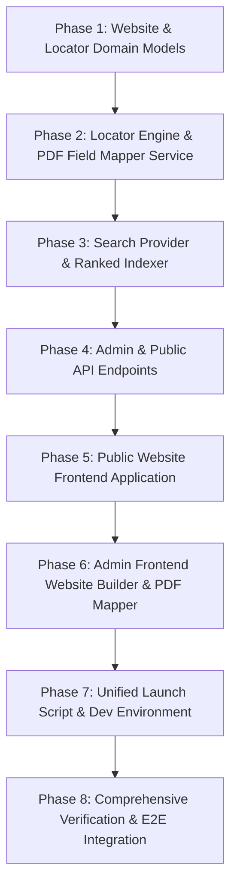

# TSWEBUI — OCR + Website Builder + Public Document Portal
## Master Architecture, Implementation Plan, and Execution Runbook

**Repository:** `Alex07lol/tswebui`  
**Base Path:** `/data/data/com.termux/files/home/storage/downloads/tswebui/ocr-platform`  
**Admin Portal Port:** `5173` (private control plane)  
**Public Website Port:** `5174` (consumer document portal)  
**Backend API Port:** `8000` (shared FastAPI service with `/api/admin` and `/api/public`)  

---

# 1. Executive Summary & Architectural Invariants

### 1.1 Core Mission
Extend `tswebui` from an OCR and Setup extraction engine into a complete **Document-Intelligence and Document-Website Platform**.

The platform provides two decoupled user experiences powered by a single shared data and domain plane:
1. **TSWebUI Admin Control Plane (`:5173`)**: Private, authenticated interface for uploading documents, running Tesseract OCR, visually teaching field locators directly on PDFs, organizing fields into Setups, and configuring/publishing searchable public document portals.
2. **Public Document Portal (`:5174`)**: High-performance, unauthenticated (or consumer-facing) web application enabling non-technical users to search engineering drawings, warranty records, invoices, or specifications, filter by structured metadata, view document details, and inspect PDFs with a high-fidelity viewer.

### 1.2 Architectural Invariants (Non-Negotiables)
1. **Preserve Existing OCR & Extraction Engine**: Do not rebuild Tesseract OCR, bounding box tracking, confidence scoring, `ExtractionRule`, `Setup`, `TeachService`, or regression testing from scratch. All new capabilities sit on top of or feed into the existing domain models.
2. **Single Source of Truth**: The public website consumes already-extracted OCR and metadata. Tesseract OCR is **never** executed during a search request.
3. **Hard Security & Route Boundary**: Different ports are an operational convenience, not a security perimeter. Security is enforced by strict API namespaces:
   - `/api/admin/*`: Requires authentication & RBAC (`ADMIN`, `EDITOR`, `WEBSITE_EDITOR`).
   - `/api/public/*`: Publicly accessible, strictly filtered to published websites and public documents. Never leaks drafts, audit logs, raw storage paths, or internal extraction evidence.
4. **Locators Compile to Normal Extraction Rules**: The visual "Teach From PDF" mapper creates `ExtractionLocator` objects that compile directly into standard `ExtractionRule` definitions. There is no parallel "PDF-only" extraction engine.
5. **Independent Versioning**: Website versions (`WebsiteVersion` v1, v2...) evolve independently from OCR Setup versions (`ConfigurationVersion` v1, v2...). Dependency tracking warns admins when modifying Setup fields referenced by live websites.

---

# 2. Complete Phased Implementation Plan

### Phase 1: Website & Locator Domain Models (Backend)
- **Database Schema**:
  - `Website`: id, name, slug, description, setup_id, status (`draft`, `preview`, `published`, `unpublished`, `archived`), current_version_id, created_by, timestamps.
  - `WebsiteVersion`: id, website_id, version_number, status, site_title, tagline, header_logo, theme_json, search_config_json, field_mappings_json, document_view_json, change_notes, published_at.
  - `WebsitePage`: id, version_id, page_type (`home`, `search`, `document`, `collection`, `about`), title, slug, layout_config_json.
  - `WebsiteCollection`: id, website_id, name, slug, description, filter_query_json, display_order.
  - `DocumentVisibility`: id, document_id, website_id, is_public, published_at.
  - `ExtractionLocator`: id, field_id, name, template_label, page_mode (`first`, `last`, `specific`, `all`), relative_region (x, y, w, h normalized 0.0-1.0), anchor_candidates_json, structure_config_json, pattern_value, tolerance_x, tolerance_y, confidence_weight, priority, is_enabled.
  - `LocatorExample`: id, locator_id, document_id, page_number, selected_text, bbox_x, bbox_y, bbox_w, bbox_h, nearby_labels_json, ocr_confidence.
  - `SearchIndexMetadata`: id, document_id, website_id, title, drawing_number, full_text, structured_fields_json, indexed_at.

### Phase 2: Locator Engine & PDF Field Mapper Service (Backend)
- **`app/services/locators/locator_service.py`**:
  - Create locator from PDF visual selection (converts absolute pixel bboxes to normalized 0.0-1.0 relative coordinates using page dimensions).
  - Extract nearby labels and text structure (same-line, next-line, horizontal/vertical alignment).
  - `compile_locator_to_rule(locator) -> ExtractionRule`: Translates locator into existing declarative strategy (`anchored_pattern` or `region` with fuzzy anchor).
- **`app/services/locators/matcher.py`**:
  - Scores candidate OCR words/lines against locator:
    `Score = w_anchor * S_anchor + w_region * S_region + w_structure * S_structure + w_pattern * S_pattern + w_ocr * S_ocr`
- **`app/services/locators/learning.py`**:
  - Multi-example learning: given selections across 2+ documents, calculates intersection/bounding hull of relative regions, extracts common recurring anchors, and produces a robust generalized locator.
- **`app/services/locators/tester.py`**:
  - Cross-document test runner: tests a locator against any set of OCR'd documents, returning per-document match status, extracted text, confidence score, and bounding boxes.

### Phase 3: Search Provider & Ranked Indexer (Backend)
- **`app/providers/search/base.py`**:
  - Abstract `SearchProvider` protocol defining `index_document`, `search`, and `remove_document`.
- **`app/providers/search/database.py`**:
  - `DatabaseSearchProvider`: SQL/ORM implementation using structured field filters, title matching, and text search.
- **`app/services/search/ranker.py`**:
  - Strict 5-tier ranking hierarchy:
    1. Exact title match (Score 1.0)
    2. Title prefix match (Score 0.85)
    3. Structured field match e.g. drawing_number, project (Score 0.70)
    4. Full OCR text occurrence (Score 0.40)
- **`app/services/search/indexer.py`**:
  - Precomputes and stores search index entries on document publication/extraction completion.

### Phase 4: Admin & Public API Endpoints (Backend)
- **Admin APIs (`/api/admin/*`)**:
  - `POST /api/admin/websites`: Create website tied to an OCR Setup.
  - `GET /api/admin/websites`: List all websites with version and status.
  - `GET /api/admin/websites/{id}`: Detailed website config, field mappings, and collections.
  - `PUT /api/admin/websites/{id}`: Update draft website configuration.
  - `POST /api/admin/websites/{id}/publish`: Validates setup, builds version snapshot, updates status to `published`.
  - `POST /api/admin/websites/{id}/unpublish`: Revokes public visibility.
  - `POST /api/admin/locators`: Create locator from PDF selection.
  - `POST /api/admin/locators/{id}/test`: Run cross-document test against documents.
  - `POST /api/admin/locators/learn`: Generate generalized locator from multiple examples.
- **Public APIs (`/api/public/*`)**:
  - `GET /api/public/sites/{slug}`: Public site theme, navigation, searchable fields, and document view config.
  - `GET /api/public/sites/{slug}/search`: Public query with structured filters, sorting, and pagination.
  - `GET /api/public/sites/{slug}/collections`: Public document collections.
  - `GET /api/public/sites/{slug}/documents/{id}`: Public document detail & extracted metadata.
  - `GET /api/public/sites/{slug}/documents/{id}/file`: Secure streaming of PDF/image file after verifying site publication and document visibility.

### Phase 5: Public Website Frontend Application (`public-site`)
- Independent React + TypeScript + Tailwind CSS application at `ocr-platform/public-site`:
  - `src/pages/HomePage.tsx`: Header, hero search bar, featured collections, recent documents.
  - `src/pages/SearchPage.tsx`: Search box, structured facet filters, sorting, responsive result cards.
  - `src/pages/DocumentDetailPage.tsx`: Document title, metadata key-value badges, download action.
  - `src/components/PDFViewer.tsx`: Canvas/image/PDF rendering with zoom, page navigation, fit-width, full-screen.
  - `src/pages/CollectionPage.tsx`: Grouped documents by collection tags/filters.
  - Development port: `5174` (with proxy `/api` -> `http://localhost:8000`).

### Phase 6: Admin Frontend Additions (`ocr-platform/frontend`)
- **Website Builder (`src/views/WebsiteBuilderView.tsx`)**:
  - Step 1: Name & Setup selection.
  - Step 2: Choose Searchable Fields & Display Fields.
  - Step 3: Configure Result Cards & Document Page Layout.
  - Step 4: Theme Selection (Engineering Dark, Modern Clean, Archival Minimal).
  - Step 5: Live Embedded Preview (`iframe` or preview renderer).
  - Step 6: Publish with validation check.
- **PDF Field Mapper / Teach from PDF (`src/views/PDFFieldMapperView.tsx`)**:
  - Interactive PDF/Document canvas rendering OCR word bounding boxes.
  - Word/box click or click-and-drag selection.
  - Visual selection inspector: selected text, token IDs, relative coordinates, nearby labels.
  - "What field is this?" modal linking selection to Setup field.
  - "Test on other documents" panel with pass/fail badges, confidence scores, and diff view.

### Phase 7: Unified Launch Script & Dev Environment
- Update `launch.sh` to support:
  - Admin frontend on `:5173`.
  - Public website on `:5174`.
  - Backend on `:8000`.
  - Background daemon mode with PID tracking for all 3 services.
  - Foreground Demo mode with live multi-service banner.

### Phase 8: Comprehensive Verification & E2E Integration
- Backend automated test suite (`pytest`) covering website CRUD, version snapshots, security boundaries, locator matching, search ranking, and PDF streaming.
- Complete End-to-End lifecycle verification:
  `Upload Document -> Run OCR -> Open PDF Mapper -> Select Title -> Create Locator -> Test on Other Docs -> Create Setup -> Create Website -> Configure Search Fields -> Publish -> Query Public Search (:5174) -> Open Document Detail -> Inspect PDF`.
